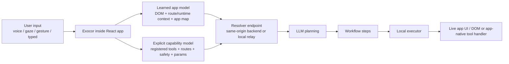

# Exocor


> **Control your app without touching it.**
>
> Voice, gaze, and gesture control for existing React apps.
> One component. No rewrites.

Exocor is a React SDK for multimodal app control.
It runs inside your app, builds app-aware runtime context, sends planning requests to a secure backend resolver, and executes the resulting workflow against the live UI.
It stays bootstrap-first, and can now also accept explicit app-native tools as a higher-confidence capability layer on top of discovery.

```tsx
import { SpatialProvider } from 'exocor'

export default function App() {
  return (
    <SpatialProvider>
      <YourApp />
    </SpatialProvider>
  )
}
```

## Install

```bash
npm install exocor
```

Peer dependencies:

- `react >= 18`
- `react-dom >= 18`

## What you can do

Instead of clicking around, users can:

- Look at a row and say: **"Open this"**
- Say: **"Navigate to equipment"**
- Say: **"Create ticket"**
- Look at a field and say: **"Edit this"**

And for more complex actions:

- **"Create a ticket for this issue"**
- **"Show me last month"**
- **"Navigate to equipment and filter for critical"**

## Why this is different from browser agents

External browser agents operate outside the app and mainly see the rendered browser surface.

Exocor runs inside the host React app.
That means it can use in-app runtime context like:

- current route and URL
- visible dialogs, buttons, fields, and tables
- app-map structure discovered from the host app
- focused element / selected text for typed input
- gaze target context for voice commands
- some React and router internals where available

Today Exocor is intentionally **hybrid**:

- it discovers app structure and runtime context from inside the app
- it can accept explicit app-native tools/capabilities from the provider
- it still uses the live DOM as a reliable execution layer and fallback

So the claim is not "zero DOM."
The claim is "app-aware planning + in-app execution," instead of operating blind from outside the app.
That planning context now combines:

- a learned app model from app-map discovery, current route, live DOM/runtime context, and gaze/focus state
- an explicit capability model from registered tools, parameter schema, route affinity, and safety metadata

## Architecture



## How it works

On mount, Exocor:

1. mounts its own SDK UI in an isolated shadow root
2. scans the host app and builds a live capability map
3. discovers and caches an app map of routes, buttons, tabs, filters, forms, and modal surfaces
4. registers any explicit tools passed to `SpatialProvider`
5. waits for a typed, voice, gaze-anchored, or gesture-driven command
6. resolves the command into workflow steps using both the learned app model and any explicit tool metadata
7. executes those steps against the live app or a trusted tool handler
8. retries or replans if the UI changes or a target goes stale

The runtime already supports:

- deterministic instant actions for simple exact commands
- deterministic exact-match shortcuts for certain explicit no-arg tools
- streamed model-based planning for multi-step workflows
- app-map-first planning where possible
- DOM execution with retries and follow-up planning
- voice clarification when a command is ambiguous

## Explicit Tools Are Additive

Explicit tools do not replace Exocor's bootstrap/discovery flow.
They are an additional semantic layer on top of the current architecture.

- Bootstrap and app-map discovery still run exactly as before.
- Registered tools give the planner higher-confidence app-native actions when a tool is clearly the best fit.
- If no tool fits, Exocor keeps using its current app-map and DOM-based planning/execution behavior.
- Tools can be global or route-specific.
- Route-specific tools stay visible to planning even when the current route is different.
- When a route-specific tool is off-route, the planner can explicitly produce a plan like "navigate, then use the tool."

Conceptually, trusted execution order is now:

1. explicit tools
2. learned app map and explicit locators
3. DOM fallback

## Registering Tools

Provider-level registration is the v1 public surface:

```tsx
import { SpatialProvider, type ExocorToolDefinition } from 'exocor'

const tools: ExocorToolDefinition[] = [
  {
    id: 'refreshDashboard',
    description: 'Refresh dashboard',
    safety: 'read',
    handler: async () => {
      await refreshDashboard()
    }
  },
  {
    id: 'createTicket',
    description: 'Create ticket',
    routes: ['/tickets'],
    safety: 'write',
    parameters: [
      {
        name: 'title',
        description: 'Ticket title',
        type: 'string',
        required: true
      }
    ],
    handler: async ({ title }) => {
      await createTicket({ title: String(title) })
    }
  }
]

export default function App() {
  return (
    <SpatialProvider tools={tools}>
      <YourApp />
    </SpatialProvider>
  )
}
```

In that example:

- `refreshDashboard` is global, so the planner can use it from anywhere.
- `createTicket` belongs to `/tickets`, but the planner still knows it exists even if the user is currently elsewhere.
- If the user is on `/dashboard`, Exocor can plan `navigate` to `/tickets` and then a `tool` step for `createTicket`.

## What runs locally

These parts run inside the host app:

- Web Speech API speech recognition
- MediaPipe face and hand tracking
- DOM scanning
- app-map discovery and caching
- route/runtime inspection
- gaze and gesture overlays
- execution of clicks, fills, submits, scrolls, and navigation
- command history and local UI feedback

## What gets sent to the resolver / LLM

Exocor sends planning context to a backend resolver, not directly to the browser.
Depending on the command, that context can include:

- the user command
- input method (`voice`, `text`, `gesture`)
- current route and URL
- compressed app context
- visible dialogs, form fields, button state, and on-screen UI structure
- app-map summary or route structure
- explicit capability metadata for all registered tools
- focused element / selected text for typed commands
- gaze target context for voice commands
- completed steps, failed steps, or newly appeared elements for replanning

Important: this is an **early hybrid runtime**, so visible UI state can be part of the model context today.
For tools, Exocor sends planner-safe metadata only: tool ids, descriptions, parameter schema, safety, route affinity, and whether the current route matches or likely requires navigation first. Runtime handlers stay local.

## What does not get sent by default

- no Anthropic API key from the browser
- no browser extension access to arbitrary websites
- no screenshots or video frames as part of the normal planning flow
- no source-code upload
- no hidden background access to apps that did not install Exocor

## Security model

Exocor does **not** accept model API keys in the browser.

For local development:

- run `npx exocor dev`
- the local relay reads `ANTHROPIC_API_KEY` from the host app root
- the browser talks to the relay at `http://127.0.0.1:8787`

For production:

- mount a same-origin resolver route such as `/api/exocor/resolve`
- keep `ANTHROPIC_API_KEY` on the server

Example:

```ts
import { createExocorResolverEndpoint } from 'exocor/server'

const handleExocorResolver = createExocorResolverEndpoint()

export async function POST(request: Request) {
  return handleExocorResolver(request)
}
```

If your route lives elsewhere:

```tsx
<SpatialProvider backendUrl="/internal/exocor/resolve">
  <App />
</SpatialProvider>
```

## Multimodal input

- **Voice** -> intent
- **Gaze** -> on-screen context like "this"
- **Gesture** -> click, drag, zoom, and interaction control

Works with a standard webcam. No special hardware required.

## Examples

These are real apps using Exocor, not mocked landing-page demos.

- **Ops Field Demo (CRM)**
  Navigation, ticket creation, and operational workflows
  [github.com/haelo-labs/haelo-ops-demo](https://github.com/haelo-labs/haelo-ops-demo)

- **3D Viewer Demo**
  Gesture control, zoom, rotation, and material changes
  [github.com/haelo-labs/3d-viewer-demo](https://github.com/haelo-labs/3d-viewer-demo)

## When this is useful

- internal tools and dashboards
- admin panels
- CRM / ERP systems
- healthcare interfaces
- industrial and field applications
- UIs where a mouse and keyboard are not always the best interface

## Current limitations

Exocor is **v0.1.1** and still early.

Today it is best described as:

- a React-first SDK
- a hybrid runtime with a learned app model plus an additive explicit capability layer
- low-config and inference-heavy by design
- more production-ready for demos and internal experimentation than broad deployment

Some interactions are instant.
More complex ones use an LLM and may take a few seconds.

The long-term direction is:

- keep low-config discovery for bootstrap
- keep expanding explicit app-native capabilities, adapters, and actions for production reliability without removing discovery

## Getting started

### Local development

```bash
# 1. Set your Anthropic key
echo "ANTHROPIC_API_KEY=sk-ant-..." > .env

# 2. Start the local relay
npx exocor dev

# 3. Run your app
npm run dev
```

### Production

Mount the resolver endpoint on your backend and wrap your app with `SpatialProvider`.

## Open source

MIT licensed. Free forever.

- GitHub: [github.com/haelo-labs/exocor](https://github.com/haelo-labs/exocor)
- Site: [exocor.dev](https://exocor.dev)
